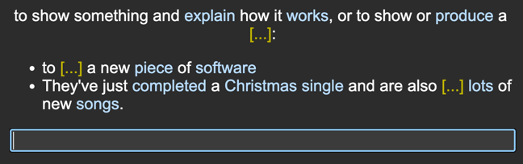
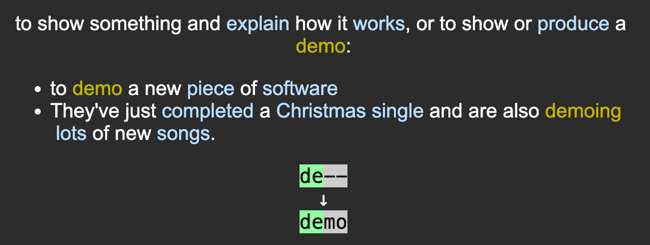

It's a simple addon for edit notes. It can hide the selected text for question view.





## card type setting

### sample Front Template
```html
{{Front}}

{{type:Back}}

<script>
document.querySelectorAll('.hideText > .hideTextFront').forEach(element => {
  element.textContent = element.textContent + '[...]'
});

document.querySelectorAll('.hideText > .hideTextBack').forEach(element => {
  element.style.display = 'none'
});
</script>
```

### sample Back Template
```html
{{FrontSide}}

<script>
document.querySelectorAll('.hideText > .hideTextFront').forEach(element => {
  element.style.display = 'none'
});

document.querySelectorAll('.hideText > .hideTextBack').forEach(element => {
  element.style.display = 'block'
});
```

### sample Styling
```css
.hideText {
	display: inline-block;
}
```
